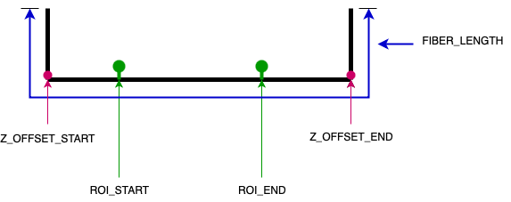
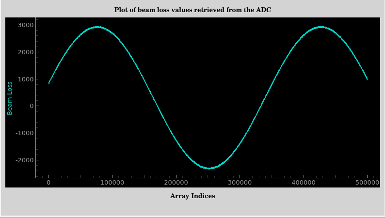
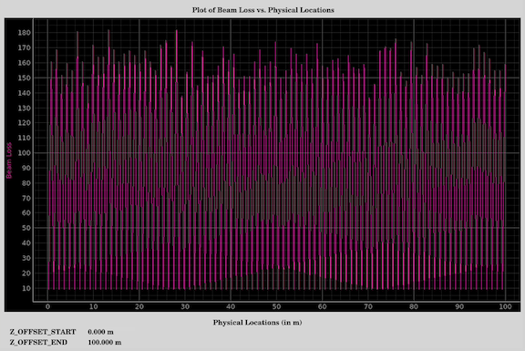
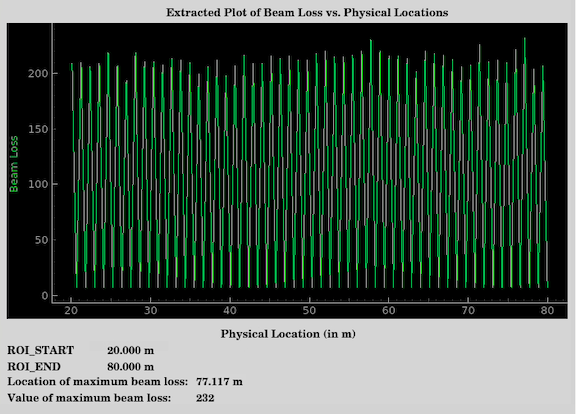

# Abstract
This is an ASYN port driver that takes a stream of data and pushes it to an EPICS waveform record

## Usage

### fourierTransform
Usage: **fourierTransform**

This command computes the fast fourier transform on a window of data from the buffer that contains the global maximum value. It gives the user the option to either output the data to the console or write it to a csv file titled output.csv and generate a graph from the csv data using a python script (plot.py).
In order to generate the graph the user must run the python script after running the fourierTransform command and selecting the option to display the graph (option 2).

NOTE: The output.csv file reads data directly from screenlog.0 which records all the keystrokes of the user. To successfully create the graph, fourierTransform must be typed without making any errors or using backspaces on the console.

### maxBeamLossLocation
Usage: **maxBeamLossLocation** <Waveform Index>

E.g. **maxBeamLossLocation** 0

This command computes and displays the physical location where the maximum beam loss is detected by a beam loss monitor based on values of the starting and ending positions of the monitor as well as the size of the buffer or data that the beam loss monitor reads. The user must enter the index of the waveform, i.e., 0, 1, or 2, for WAVEFORM:0, WAVEFORM:1, or WAVEFORM:2, respectively.
A minimum threshold value can be set for detecting maximum beam loss by writing to `$(P):THRESHOLD:${channel}`.

The waveformExtraction command must be executed before executing this command.

### resetRegisters
Usage: **resetRegisters**

This command sets relevant registers to values required by the port driver to function properly.

### waveformExtraction
Usage: **waveformExtraction** <Waveform Index>

E.g. **waveformExtraction** 0

This command extracts the relevant portion of the waveform data required for the detection of maximum beam loss location. 
The relevant portion is determined in three steps. First, we extract data corresponding to the complete length of the fiber and discard the excess data.
Second, we remove the data representing the vertical parts of the optical fiber on either side since this data mostly represents noise. This is done by using
`$(P):Z:OFFSET:START:${channel}` and `$(P):Z:OFFSET:END:${channel}`. Finally, we extract another subset of this data which represents the portion the user wants to
focus on for the maximum beam loss location detection. This is done by utilizing the values entered by the user in the `$(P):START:EXTRACTION:${channel}` and 
`$(P):END:EXTRACTION:${channel}` process variables.

This command saves the extracted waveform data in the following PVs:
  1. `$(P):EXTRACTED:WF:${channel}` => contains the extracted waveform data.
  2. `$(P):EXTRACTED:X:WF:${channel}` => contains an x-axis of values corresponding to the physical locations of the waveform data values.

This command must be called before calling maxBeamLossLocation. 

This command uses the following PVs for the extraction:
  1. `$(P):CLK:FREQUENCY`
  2. `$(P):SLOPE:${channel}`
  3. `$(P):OFFSET:${channel}`
  4. `$(P):Z:OFFSET:START:${channel}`
  5. `$(P):Z:OFFSET:END:${channel}`
  6. `$(P):SPEED`
  7. `$(P):START:EXTRACTION:${channel}`
  8. `$(P):END:EXTRACTION:${channel}`
  9. `$(P):FIBER:LENGTH:${channel}`

The following diagram can be used as a reference to visualize the fiber and the PVs:

### waveformStatus
Usage: **waveformStatus**

This command provides a health-check for the various streams our port driver is connected to by displaying relevant data about the waveforms, such as their streaming status, their date and time of initialization, the time each stream takes to read data from hardware, etc.

### waveformStreamInit
Usage: **waveformStreamInit** "<Path to stream>" "<Waveform record asyn Identifier>"

E.g. **waveformStreamInit** "/Stream0" "WAVEFORM:0"

This command initializes a thread that connects to your specified stream, reads from the stream and proceeds to write the data it receives to the waveform record you specify.

## Importing
To import this WaveformReader as a module, follow the steps listed [here](https://confluence.slac.stanford.edu/spaces/ACHIP/pages/610483645/Steps+to+add+WaveformReaderAsyn+to+another+app).

## PyDM Displays
This WaveformReader has three pydm screens associated with it:
1. raw_waveform_data.ui => This displays the entire data buffer that we retrieve from the hardware.
2. complete_waveform_data.ui => This displays the waveform from Z:OFFSET:START to Z:OFFSET_END i.e., the waveform data obtained after removing the redundant data representing the vertical parts on either end of the fiber.
3. extracted_waveform_data.ui => This displays the waveform from START:EXTRACTION to END:EXTRACTION i.e., a subset of the complete_waveform_data obtained by extracting the waveform data between starting and ending locations entered by the user.

To open the displays use the following commands:
1. pydm -m '{"P":"MPLN:UNDH:MP06:6", "channel":0}' raw_waveform_data.ui
2. pydm -m '{"P":"MPLN:UNDH:MP06:6", "channel":"0"}' complete_waveform_data.ui
3. pydm -m '{"P":"MPLN:UNDH:MP06:6", "channel":"0"}' extracted_waveform_data.ui

You can change the channel depending on which waveform you want to display.

Here are sample screenshots of the three screens:

1. 
2. 
3. 

